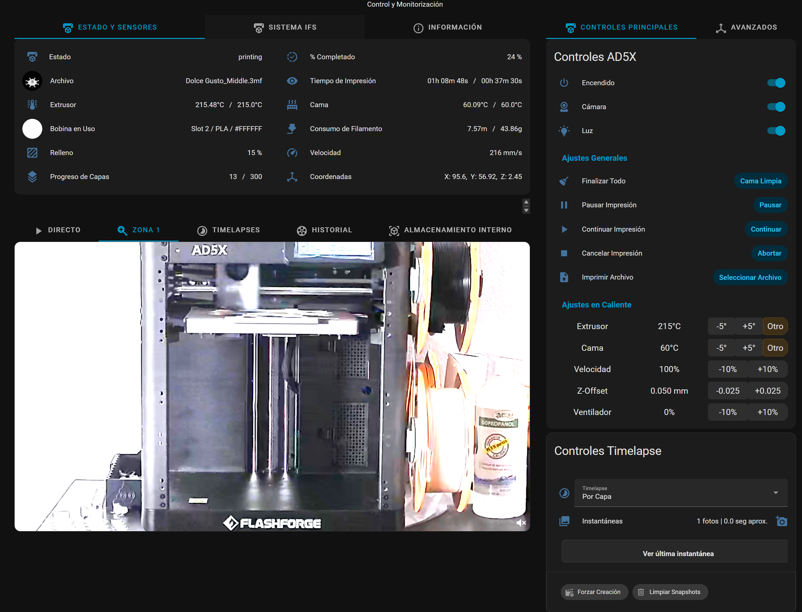
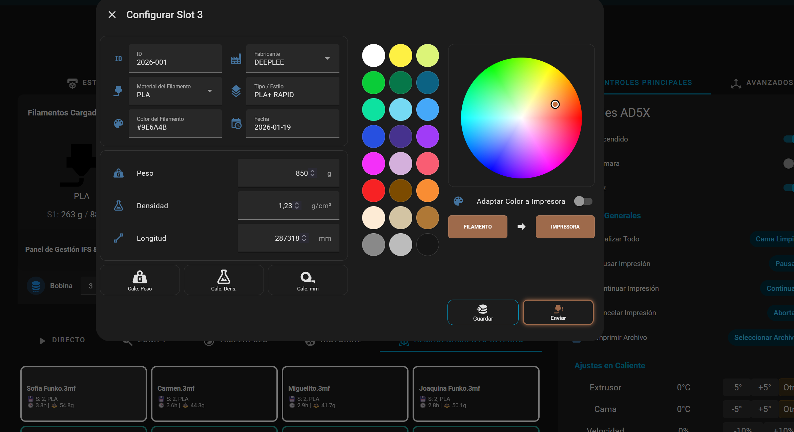
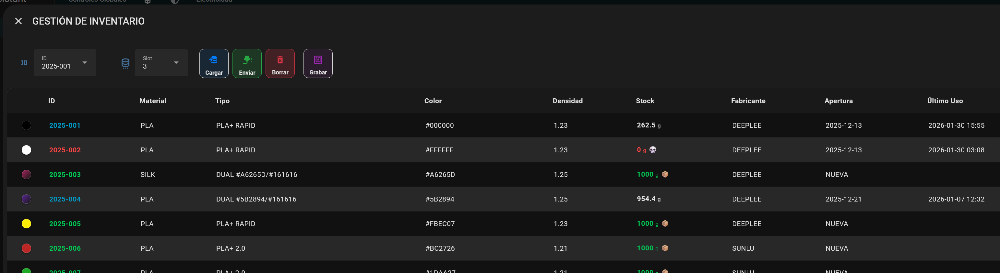
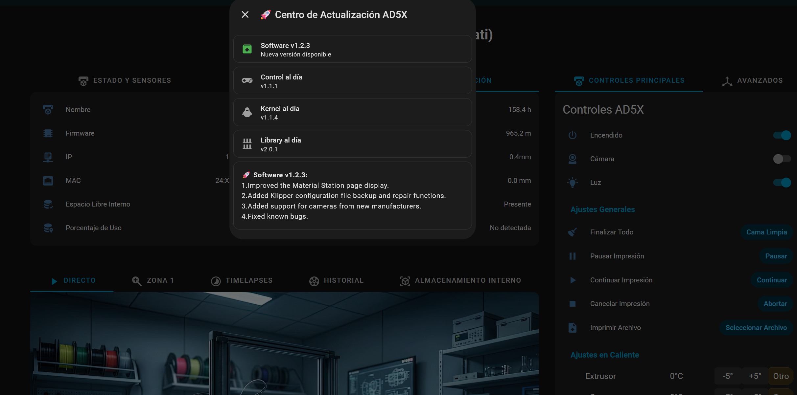

# HA FlashForge AD5X
It's not a universal HACS integration; it's my highly customized integration tailored to my needs. This isn't a universal HACS integration; While it could potentially work on other models, it would require modifications and changes due to the IFS system.

### 📸 Galería del Proyecto

| Status and Sensors | IFS and advanced | Printing Options |
| :---: | :---: | :---: |
|  |  |  |
| **Configure SLOT** | **Storage Management** | **Update System** |
|  |  |  |

Status and Sensors:
- Real-time display of printer status and print progress: Status, current/target temperatures, Image Model, spool in use, speed, layers...
- Printer Name (Editabled), Firmware (with check and download updates), IP/MAC, used/free internal storage, total time and filament, nozzle, IFS/camera(interal) status

Live Monitoring:
- Use of your own camera, not FF native one
- Camera controls: Resolution, Night Vision, Abnormal motion detection... etc
- Different Zones and Framing
- Automatic full recording of each print. Retention for 7 days, the are generally used only as a diagnostic tool when something fails, to pinpoint the exact location and time.
- Recordings and Timelapses Browser. Timelapses are not deleted.
- Model Gallery (and Printing): Limited to 10 models by the printer's API, it only lists the last 10 stored models, allowing you to print any of them.

Controls:
- Basic Printer Control: Power on, camera/led power, pause, cancel, resume, clean bed
- Advaneced Printer Controls: On-the-fly adjustments: speed, z-offset, fan, bed/extruder temperature). JOG Controls, goToHome, Calibrations and RAW GCode
- Precise Timelapse Controls (Third party Camera): Automatic Timelapse creation taking images by layers, 30sec or 60secs. Option to force Timelapse in any moment or clear all snapshots
- Direct printing: From a local file, or a file in the Model Gallery. Leveling, flow control, first layer inspection, and slot selection.

IFS System
- Complete IFS control: Status and configuration of the 4 active slots. Only Color and Material are used by the printer; the remaining parameters are for internal management.
	- Visual Status of currnent slots: material, color and Weight/length remaining, with color warning depending on the amount of filament remaining
	- Choose Predefined colors/materials or a custom (any) color/material.
	- Custom Subtype/style
    - Weight/length remaining and density. With two of them, you can calculate the third.
	- Manufacturer, date opened and last use 
- Load/Unload filament Controls
- IFS module operation status report
- Automatic update of remaining filament, per slot. Margin of error measured between 1-5%. WARNING: Not yet adjusted for multicolor printing

Filament Storage management
- Table with all my registered spools (status, color, material, remaining Weight/length...). 
- Allow you to load (only local) or send (to the printer) any spool into any slot.
- Allow you to add a new spool or remove a old one

Filament NFC Tag system (NFC NTAG215 (504Bytes)
- Own storage "format" designed to not exceed 256 bytes (currently around 200-220)
- Use the same data header and control as the tags written by HA (152 bytes), not included in the previous count
- Format:
	- TAG Pages 04-41 -> HomeAssistant Header (152Bytes)
	    - https://www.home-assistant.io/tag/IDTAG
		- io.homeassistant.companion.android
		- io.homessistant.ccompanion.android.minimal
	- TAG Pages 32-96 > My Own format (max 256Byte)
	    - JSON Format
		- Atributes: "id", "material", "submaterial", "color", "densidad", "peso", "longitud", "fabricante", "fecha", "ultimo_uso".
		- the unique id its shared and used for HA IDTAG too. Format: Year-XXX (2026-125)
- Different modes of use and operation, depending on whether we use the mobile phone or an external NFC reader.
	- HA Automatic: Bring the phone close to the spool tag., and it will display in your phone simplified filament information directly, without needing to open HA. 
	- HA Automatic: Load your spool directly into one of the four active slots if desired (local and printer)
	- Automatic notification to write the tag of any newly added spool (External NFC reader/writer)
	- Tag Operations (External NFC Reader/Writer)
		- Check: Show in HA filament information inside the tag
		- Read: load the Tag information to the selected slot
		- Write: Write the filament information for the selected slot in the Tag.
		- Clear: Format/Clean Tag
	- Write a Tag for any filament from the Storage Management. 
	
Want to swap any spool? No problem, the "DB" is always up-to-date. Simply write the tag with the updated information before storing it. This way, the information is always maintained both, internally and on the spool's tag.
You can always easily and immediately scan it with your mobile phone when it is stored, and have all the data about it.

Missing/TODO:

- Investigate how to change Nozzle Model (0.25, 0.4...)
- Investigate how to safely list and delete internal models (Only 10 are listed and not remote deleting its allowed)
- Decide whether or not to integrate manual extrusion controls
- Add Native Camera: Since firmware 1.2.3 allows third-party cameras to be connected directly to the printer, once it's working properly I'll integrate a couple more things to coexist with the current viewing system, as well as the native camera controls.
- Multi-material: I don't usually print in more than one color at a time. After I do a couple of tests, I'll adjust the filament consumption per spool accordingly.
